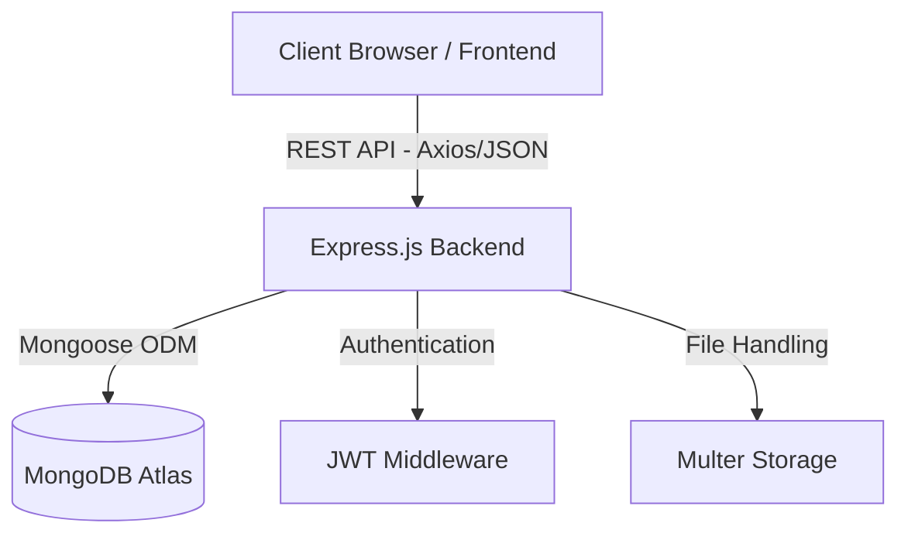

# MINDScall (Cube Highways Innovation Management Platform)

## 1. Project Overview

**What is MINDScall:**
MINDScall is a comprehensive, enterprise-grade Innovation Management Platform specifically designed for Cube Highways. It provides a structured, digital gateway for capturing, evaluating, and managing innovative ideas and proposals originating from employees across the organization.

**Business Objective:**
To foster a culture of innovation by streamlining the lifecycle of ideas and proposals. MINDScall digitizes the end-to-end workflow from initial submission to final approval and implementation, ensuring transparency, accountability, and proper governance.

**Problem it Solves:**
* Eliminates unstructured, fragmented submission of ideas via emails or paper forms.
* Removes bottlenecks in reviewing, evaluating, and approving innovation proposals.
* Provides a centralized tracking mechanism, ensuring no idea gets lost.
* Facilitates structured evaluation by domain experts and automated tracking of ongoing R&D projects.

**Intended Users:**
* **CEO & Chairman:** High-level oversight, executive summaries, and final approval visibility.
* **Finance Team:** Financial feasibility review, budget estimation, and cost-benefit analysis.
* **R&D Team:** Initial review, ongoing project tracking, and timeline management.
* **Evaluation Committee:** Domain-specific review, technical evaluation, and scoring.
* **Department Heads:** Departmental oversight and alignment with strategic goals.
* **Employees:** Idea generators, submitting proposals and tracking their progress publicly.

---

## 2. Technology Stack

### Frontend
* **React:** Core component-based UI library.
* **Vite:** Next-generation frontend tooling for rapid development and optimized builds.
* **Material UI (MUI):** Comprehensive enterprise-grade component library for consistent and responsive design.
* **React Router:** Declarative routing for seamless single-page application (SPA) navigation.
* **Axios:** Promise-based HTTP client for robust API communication.

### Backend
* **Node.js:** JavaScript runtime environment for scalable server-side execution.
* **Express.js:** Minimalist, fast web framework for building robust RESTful APIs.

### Database
* **MongoDB Atlas:** Fully managed, cloud-native NoSQL database for flexible and scalable data storage.
* **Mongoose:** Elegant MongoDB object modeling for Node.js, providing schema validation and relationship mapping.

### Additional Technologies
* **Authentication:** JWT (JSON Web Tokens) for secure, stateless user authentication and authorization.
* **File Uploads:** Multer for handling `multipart/form-data` and robust file storage management.
* **Reporting:** CSV Export functionalities for data extraction and reporting.

---

## 3. System Architecture

The MINDScall platform follows a modern, decoupled client-server architecture ensuring high performance, scalability, and maintainability.

**Module Interactions:**
1. **Frontend Client** requests or submits data.
2. **Express Backend** intercepts the request, routes it, and verifies authorization using **JWT**.
3. Business logic is executed. If files are included, **Multer** processes them.
4. Data is queried or mutated in **MongoDB Atlas** via **Mongoose**.
5. Formatted JSON responses are returned to the client.

---

## 4. Workflow Architecture

The lifecycle of an idea or proposal follows a strict governance workflow:

`Submission` ➔ `R&D Review` ➔ `RM Review` ➔ `Evaluation Committee` ➔ `Finance Review` ➔ `Approval Committee` ➔ `R&D Ongoing Projects`

1. **Submission:** Employees submit an Idea or Proposal using dynamic forms.
2. **R&D Review:** The R&D department acts as the first filter, assessing alignment and completeness.
3. **RM (Reporting Manager) Review:** Departmental alignment and preliminary managerial approval.
4. **Evaluation Committee:** Subject matter experts are assigned to evaluate technical merit, feasibility, and impact.
5. **Finance Review:** Detailed financial analysis, budget validation, and ROI estimation.
6. **Approval Committee:** Final gate for executive approval, rejection, or requests for modification.
7. **R&D Ongoing Projects:** Approved submissions transition into active projects, monitored for milestones and benefits realization.

---

## 5. Form Builder System

The system features a robust, dynamic Form Builder allowing administrators to create and manage submission templates without code changes.

* **Dynamic Forms:** Drag-and-drop or configuration-based UI to construct complex forms tailored to specific innovation campaigns.
* **Version Control:** Maintains historical versions of forms ensuring past submissions map correctly to the schema they were submitted against.
* **Public Form Links:** Generation of shareable URLs allowing easy access for employees across the organization.
* **Form Publishing:** Draft and live states to control when new form versions are available to users.
* **Form Submissions:** Structured storage of user inputs linked to the active form version.
* **CSV Exports:** Bulk data extraction of form submissions for external analysis.

---

## 6. Submission Types

MINDScall categorizes submissions into two primary tracks:

1. **Idea:** A preliminary concept, suggestion, or innovation that requires further development, research, or proof-of-concept. Typically requires less rigorous initial documentation.
2. **Proposal:** A well-researched, structured business case with defined methodology, budget estimates, and timelines, ready for detailed evaluation and potential implementation.

---

## 7. Form Structure

Submissions capture comprehensive data points distributed across logical sections:

* **Employee Information:** Submitter details, department, location, and contact info.
* **Submission Details:** Title, category, and fundamental tracking details.
* **Idea Details:** Core concept, problem statement, and proposed solution.
* **Project Overview:** Objectives, scope, and expected outcomes.
* **Methodology:** Technical approach, implementation steps, and resource requirements.
* **Project Team & Collaborations:** Internal stakeholders, external partners, and resource allocation.
* **Milestones & Timelines:** Phase-wise delivery schedules and key deliverables.
* **Financial Estimate:** Budget requirements, cost breakdown, and projected ROI.

---

## 8. Tracking ID System

To ensure traceability and easy reference, every submission is assigned a unique tracking ID upon creation:

* **Idea:** `MCI-XXXXXXXX` (e.g., MCI-20231015)
* **Proposal:** `MCP-XXXXXXXX` (e.g., MCP-20231016)

**Purpose:** Provides a universal reference for public tracking, internal communication, cross-referencing in meetings, and audit trails.

---

## 9. WBS (Work Breakdown Structure) System

A systematic classification protocol is used for internal organization and automated routing:

**Format:** `[Category Initial][Sub Category Initial][Innovation Type Initial]-[Sequential Number]`

**Examples:**
* **TPC-001:** Technology (T), Process (P), Continuous Improvement (C) - 001
* **TPD-001:** Technology (T), Process (P), Disruptive (D) - 001
* **ESC-001:** Engineering (E), Safety (S), Continuous Improvement (C) - 001

**Purpose:** Enables granular internal classification, automated assignment to specific Evaluation Committees, and detailed multidimensional reporting.

---

## 10. Evaluation Committee

A dedicated module for technical and peer review.

* **Committee Creation:** Admins can form specialized groups based on domain expertise (e.g., Civil Engineering, IT, Operations).
* **Batch Assignment:** Multiple submissions can be assigned to a committee simultaneously for efficiency.
* **Email Notifications:** Automated alerts to committee members when new evaluations are assigned.
* **Evaluation Process:** Structured scoring matrices and rubric-based assessment.
* **Review Remarks:** Mandatory qualitative feedback captured alongside quantitative scores.

---

## 11. Finance Review

Ensures financial viability before executive approval.

* **Financial Feasibility Review:** Deep-dive analysis of proposed budgets vs. expected ROI.
* **Recommendation Workflow:** Finance can flag issues, request clarifications, or recommend approval/rejection.
* **Finance Remarks:** Detailed financial notes attached permanently to the submission record.

---

## 12. Approval Committee

The final authority gateway.

* **Final Approval Authority:** Restricted to senior leadership / designated executives.
* **Approval Decision:** Binary (Approve/Reject) or conditional approval mechanisms.
* **Rejection Workflow:** Captures rejection rationale, allowing for potential resubmission or closure of the tracking lifecycle.

---

## 13. R&D Ongoing Projects

Post-approval lifecycle management.

* **Approved Ideas and Proposals:** Automatically transitions successful submissions to this dashboard.
* **Project Owner:** Assignment of a dedicated lead accountable for execution.
* **Status Tracking:** Kanban or list views reflecting current execution stages (e.g., Initiation, Execution, Testing, Closure).
* **Progress Updates:** Periodic logging of achievements against milestones.
* **Benefits Tracking:** Post-implementation review comparing actual ROI against proposed estimates.
* **Timeline History:** Immutable audit log of all phase transitions and status changes.

---

## 14. Security Architecture

Enterprise-grade security measures are baked into the core.

* **JWT Authentication:** Stateless, encrypted tokens ensuring secure session management.
* **Protected APIs:** Strict middleware verifying token validity and user roles before resolving backend routes.
* **Input Validation:** Sanitization of all incoming data to prevent NoSQL injection and XSS attacks.
* **Role Restrictions:** Role-Based Access Control (RBAC) ensuring users only see and interact with data permissible by their designation.
* **MongoDB Security:** Deployed on Atlas with IP whitelisting, encrypted data at rest, and transport layer security (TLS).

---

## 15. Database Collections

The MongoDB schema is highly relational (via references) to maintain data integrity.

* **Users:** Stores credentials, roles, and profile information.
* **Forms:** Master records of form configurations and UI schemas.
* **FormVersions:** Immutable snapshots of forms to preserve historical context of submissions.
* **Submissions:** The core transactional records holding all user input, linked to users and form versions.
* **Audit Logs:** System-generated logs tracking critical events (who did what, when) for compliance.
* **Evaluation Batches:** Groupings of submissions assigned to specific committees.

---

## 16. Reporting & Analytics

Actionable insights for management.

* **Dashboard KPIs:** Real-time metrics on total submissions, pending reviews, and approval rates.
* **Submission Statistics:** Breakdown by category, department, and timeline.
* **Approval Statistics:** Conversion rates from submission to final approval.
* **Export Functionality:** 1-click CSV generation for deep-dive analysis in Excel or BI tools.

---

## 17. Current Enterprise Readiness Assessment

* **Workflow:** **8/10** (Robust, linear progression; room for parallel routing).
* **Security:** **9/10** (Strong JWT & RBAC implementation; cloud security standard).
* **Reporting:** **7/10** (Solid basic KPIs; advanced data visualization pending).
* **UI/UX:** **8/10** (Clean Material UI implementation; high user adoption probability).
* **Governance:** **9/10** (Clear auditing, structured WBS, and distinct approval gates).
* **Scalability:** **9/10** (Decoupled architecture scales horizontally effortlessly).

---

## 18. Future Roadmap

Planned enhancements to elevate the platform:

* **Executive Dashboard:** C-suite specific views focusing on financial impact and strategic alignment.
* **Audit Trail:** Enhanced visual history of every field change within a submission.
* **Timeline System:** Gantt chart integration for R&D Ongoing Projects.
* **Email Tracking:** In-app visibility of all automated communications sent to users.
* **Duplicate Detection:** AI/NLP-based matching to alert users if a similar idea exists during drafting.
* **Benefits Realization:** Long-term financial tracking module comparing actuals vs. projections post-deployment.
* **SLA Monitoring:** Alerts for submissions stuck in a specific workflow stage beyond acceptable timeframes.

---

## 19. Deployment Architecture

* **Frontend:** Hosted on **Netlify**, leveraging its global CDN for ultra-fast asset delivery and automated CI/CD from the repository.
* **Backend:** Deployed on **Render**, providing scalable Node.js hosting with integrated health checks and environment management.
* **Database:** Hosted on **MongoDB Atlas** (Cloud), offering automated backups, auto-scaling, and multi-region availability.

**Environment Variables:** Strictly managed within the respective CI/CD platforms (Netlify/Render) keeping sensitive keys (JWT Secrets, DB URIs) out of version control.

---

## 20. Executive Summary

**MINDScall** represents a strategic digital transformation initiative for Cube Highways, replacing ad-hoc innovation tracking with a structured, transparent, and highly secure enterprise platform. Built on a modern MERN-equivalent stack (React, Node, Express, MongoDB Atlas), it provides end-to-end lifecycle management—from the moment an employee submits an idea, through rigorous technical and financial evaluations, to final executive approval and project execution.

With built-in governance (RBAC, Audit Logs, WBS classification) and a scalable architecture, MINDScall is fully equipped to drive and measure the ROI of Cube Highways' innovation portfolio today, while offering a clear roadmap for advanced analytics and enterprise integrations in the future.
